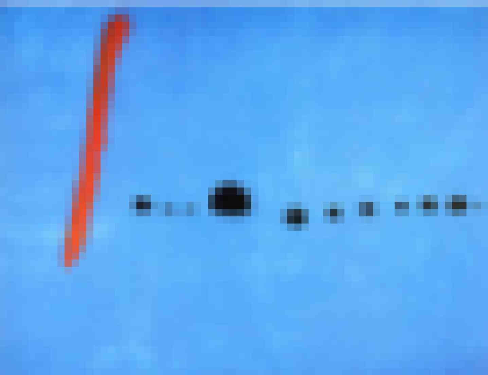

# OXYTRIBE

*Original painting credit: Joan Miró - Blue II*

This is an attempt to improve the HyperTRIBE software by using Nextflow and Rust, with simpler logic and easier implementation

## TODO

- [x] Converting sam_to_matrix.pl to Rust
- [x] Using a simpler approach without Database
- [x] All the processes until the final TSV file are either in Nextflow or Rust
- [x] Wrap the workflow with Nextflow
- [x] Delete the modules that already exist in nf-core
- [x] Annotate the editing sites in the TSV file
- [x] Add an R script for top edited genes with threshold like 5% and 1% and some stats
- [x] Add UMI extract
- [x] USE UMI dedup
- [x] OW, use cordinate based dedupping
- [x] Trimming process 
- [x] Add containers for R analysis script
- [x] Allow for subtracting the editing sites from controlVscontrol
- [x] Add containers for the rust binaries to support multiple platforms
- [ ] Testing
- [ ] Update the documentation for installation and usage

# HyperTRIBE
HyperTRIBE is a technique used for the identification of the targets of RNA binding proteins (RBP) in vivo. This is an improved version of a previously developed technique called TRIBE (Targets of RNA-binding proteins Identified By Editing).

Please get the code from GitHub or download from here: 

Detailed doumentation is available at: http://hypertribe.readthedocs.io/en/latest/

For more details please see:

1. Xu, W., Rahman, R., Rosbash, M. Mechanistic Implications of Enhanced Editing by a HyperTRIBE RNA-binding protein. RNA 24, 173-182 (2018). doi:10.1261/rna.064691.117

2. McMahon, A.C.,  Rahman, R., Jin, H., Shen, J.L., Fieldsend, A., Luo, W., Rosbash, M., TRIBE: Hijacking an RNA-Editing Enzyme to Identify Cell-Specific Targets of RNA-Binding Proteins. Cell 165, 742-753 (2016). doi: 10.1016/j.cell.2016.03.007.
