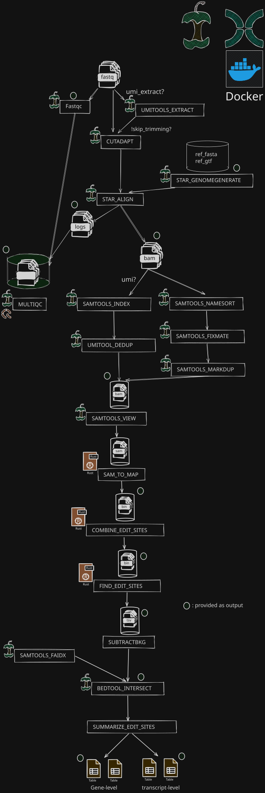

# OXYTRIBE
OXYTRIBE is a Nextflow pipeline for HyperTRIBE RNA editing identification and gene-level target prioritization. It is a full rewrite of the original [HyperTRIBE](https://github.com/rosbashlab/HyperTRIBE) computational pipeline, replacing the Perl/Python/MySQL stack with Rust binaries and Nextflow, removing the database dependency entirely, and adding support for multi-replicate comparison with configurable AND/OR logic. Note, this is not a typical rewrite where the same logic is retained, OXYTRIBE uses a very different approach across all main steps from HyperTRIBE.

## TODO

- [x] Converting sam_to_matrix.pl to Rust
- [x] Using a simpler approach without Database
- [x] All the processes until the final TSV file are either in Nextflow or Rust
- [x] Wrap the workflow with Nextflow
- [x] Delete the modules that already exist in nf-core
- [x] Annotate the editing sites in the TSV file
- [x] Add an R script for top edited genes with threshold like 5% and 1% and some stats
- [x] Add UMI extract
- [x] USE UMI dedup
- [x] OW, use cordinate based dedupping
- [x] Trimming process 
- [x] Add containers for R analysis script
- [x] Allow for subtracting the editing sites from controlVscontrol
- [x] Add containers for the rust binaries to support multiple platforms
- [x] Testing
- [ ] Validation using the HyperTRIBE sample data
- [x] Update the documentation for installation and test profile
- [ ] Docs for parameters
- [ ] Docs for validation
- [ ] Docs for outputs

## Architecture
The pipeline is handled  using Nextflow (DSL2). Read processing, alignment, and QC are handled via standard bioinformatics modules (nf-core), followed by a custom 3 Rust binaries for candidate site identification, and downstream R / Bedtools modules for background subtraction, GTF annotation, and target summarization.All modules here support docker containers and apptainers, custom binaries uses sha digests to insure reproducablity.


 
# Installation
 
OXYTRIBE requires only [Pixi](https://pixi.sh) to manage all dependencies including Nextflow, nf-core tools, R, and SRA toolkit.
 
```bash
# install pixi if not already installed
curl -fsSL https://pixi.sh/install.sh | sh
 
# clone and install
git clone https://github.com/fragilefort/oxytribe.git
cd oxytribe
pixi install
```
 
Containers (Docker or Singularity/Apptainer) are required to run the pipeline since the nf-core modules and Rust binaries are distributed as container images. Docker or Singularity must be available on your system.

## Quick start
 
Download the test data and run the validation dataset from the original HyperTRIBE paper (GSE102814, Drosophila dm6):
 
```bash
# Use docker images
pixi run test-docker
# Or use singularity
pixi run test-singularity
```
 
This command:
1. Downloads 4 FASTQ files from SRA (Hrp48 HyperTRIBE rep1/rep2, wtRNA control, HyperADARcd background)
2. Downloads the dm6 reference genome from UCSC
3. Runs the full pipeline end-to-end using the test profile
Expected output is in `ChinaTown/` with editing sites for the `HyperTRIBE_vs_wtRNA` comparison.

## Project structure (for development)
```
oxytribe/
├── crates/
│   ├── sam_to_map/
│   ├── combine_edit_sites/
│   └── find_edit_sites/
├── workflow/
│   ├── main.nf                 # nextflow entry
│   ├── nextflow.config         # pipeline configuration entry point
│   ├── modules.json            # nf-core module tracking state
│   ├── bin/                    # executable binaries and downstream scripts
│   │   ├── subtract_background.r
│   │   ├── summarize_edit_sites.r
│   │   └── match_sites.r       # validation script
│   ├── conf/
│   │   ├── params.config       # default parameter values
│   │   ├── process.config      # process resource allocations
│   │   ├── profiles.config     # execution profiles (local, server, singularity)
│   │   └── test.config         # test profile configuration
│   ├── containers/
│   │   ├── oxytribe-rust/      # Dockerfile for Rust binaries
│   │   └── oxytribe-r/         # Dockerfile for R execution
│   ├── contract/               # input schema definitions and test datasets
│   │   ├── input.csv
│   │   ├── comparisons.csv
│   │   ├── chromosomes.txt
│   │   ├── sim_input.csv
│   │   └── test/               # automated test profile data
│   │       ├── download_test_data.sh
│   │       ├── ref_genome/     # test genome fasta/gtf
│   │       └── validation_data/# HyperTRIBE result for validation
│   └── modules/
│       ├── local/
│       │   ├── samtomap/
│       │   ├── combine_edit_sites/
│       │   ├── find_edit_sites/
│       │   ├── subtractbkg/
│       │   └── summarize_edit_sites/
│       └── nf-core/
│           ├── bedtools/
│           ├── cutadapt/
│           ├── fastqc/
│           ├── multiqc/
│           ├── samtools/
│           ├── star/
│           └── umitools/
├── docs/
│   ├── parameters.md
│   ├── output.md
│   └── validation.md
└── pixi.toml                   # environment and reproducible task definitions
```

## Contributions
Contributions are welcome via issues and PRs

# HyperTRIBE
HyperTRIBE is a technique used for the identification of the targets of RNA binding proteins (RBP) in vivo. This is an improved version of a previously developed technique called TRIBE (Targets of RNA-binding proteins Identified By Editing).

Please get the code from GitHub or download from here: [](https://zenodo.org/badge/latestdoi/114820120)

Detailed doumentation is available at: http://hypertribe.readthedocs.io/en/latest/

For more details please see:

1. Xu, W., Rahman, R., Rosbash, M. Mechanistic Implications of Enhanced Editing by a HyperTRIBE RNA-binding protein. RNA 24, 173-182 (2018). doi:10.1261/rna.064691.117

2. McMahon, A.C.,  Rahman, R., Jin, H., Shen, J.L., Fieldsend, A., Luo, W., Rosbash, M., TRIBE: Hijacking an RNA-Editing Enzyme to Identify Cell-Specific Targets of RNA-Binding Proteins. Cell 165, 742-753 (2016). doi: 10.1016/j.cell.2016.03.007.
